# Reference Apps

This repository contains rendered templates from [core-platform-software-templates](https://github.com/coreeng/core-platform-software-templates) repository.
Every time any template is changed `render-templates.yaml` workflow is triggered.
This workflow renders all templates, commits the changes and dispatches the app-specific P2P workflows for updated templates.
Here is a quick diagram describing with an example of the process:

```mermaid
sequenceDiagram
    actor C as Client
    participant ST as core-platform-software-templates
    box core-platform-reference-applications
      participant RT as render-templates.yaml
      participant FF as go-web-fast-feedback.yaml
      participant ET as go-web-extended-test.yaml
      participant PROD as go-web-prod.yaml
    end
    
    C ->> ST: Update 'go-web' template
    
    ST ->> RT: Trigger workflow
    RT ->> RT: Render all templates
    RT ->> RT: Push updates for 'go-web' template
    RT ->> FF: Trigger Fast Feedback for 'go-web'
    FF -->> RT: Completed
    RT ->> ET: Trigger Extended Test for 'go-web'
    ET -->> RT: Completed
    RT ->> PROD: Trigger Prod for 'go-web'
```


Hence, changes to applications are happening automatically
and any application update made directly to this repository will be overwritten.
If you want to update an application, please make a PR
to [core-platform-software-templates](https://github.com/coreeng/core-platform-software-templates) repository.

# Quick Start
_*Prerequisite*_: it is assumed that you have `corectl` installed and initialized.
Read more about `corectl` [here](https://github.com/coreeng/corectl).

You can fork this repository to your organization and use it as a starting point for your own applications.

The only thing you need to do to make P2P work properly for your organization is to run:
```bash
corectl p2p env sync <your-repository> <your-tenant>
```
This will use configuration from your environments to prepare your repository for P2P.

In addition, it's recommended that you also delete workflows which are used to maintain this repository:
```bash
rm .github/workflows/render-templates.yaml
git commit -m "Delete maintaining workflows"
git push
```

# Configured workflows

## Template rendering
These are used to render templates. Should be deleted after forking.
- [render-templates.yaml](.github/workflows/render-templates.yaml) -
  fetches all the templates from [core-platform-software-templates](https://github.com/coreeng/core-platform-software-templates) repo, 
    renders them and collects ids of changed templates.
  For each changed template, it dispatches that app's root Fast Feedback, Extended Test and Prod workflows in sequence.

## P2P workflows
Each reference application has root workflows named after the application and stage:

- `<app>-fast-feedback.yaml` - runs Fast Feedback on push and pull requests for changes under `<app>/**`, and can be manually dispatched.
- `<app>-extended-test.yaml` - runs Extended Test on schedule or manual dispatch.
- `<app>-prod.yaml` - runs Prod on schedule or manual dispatch.

The workflow names use the `<app> Fast Feedback`, `<app> Extended Test` and `<app> Prod` format so the Core Platform Dashboard can discover and display each application's P2P status.
